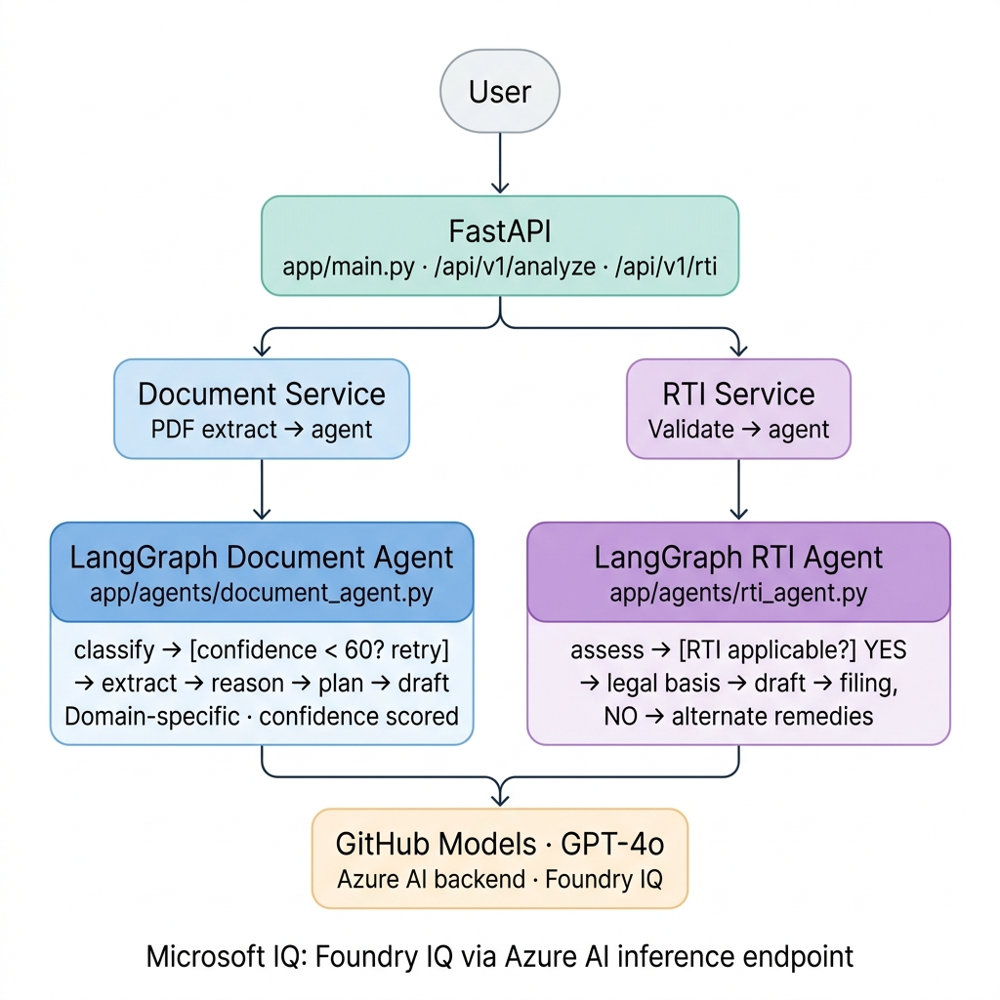

# NyayBot

**AI-powered legal reasoning agent for Indian citizens.**

800 million Indians receive government documents they don't understand. Lawyers cost Rs 2,000/hour. NyayBot gives instant legal clarity for free — upload any document, describe your problem, and get rights analysis, action plans, and drafted letters in seconds.

---

## What It Does

**Document Analysis** — Upload any government or legal PDF (income certificates, court notices, RTI denials, land records, eviction notices). NyayBot classifies the document, extracts key facts, reasons over applicable Indian laws, generates a step-by-step action plan, and drafts a formal response letter.

**RTI Copilot** — Describe your problem in plain language. The agent reasons whether the Right to Information Act 2005 applies, identifies the exact department to file with, drafts a complete RTI application citing correct sections, and provides filing instructions with deadlines and appeal rights.

---

## Architecture

<p align="center">
  
</p>

```
User
 |
 v
FastAPI (app/main.py)
 |
 |-- POST /api/v1/analyze --> document_service --> LangGraph Document Agent
 |                                                      |
 |                                    classify -> [confidence < 60%? retry] -> extract
 |                                         -> reason -> plan -> draft -> steps_log
 |
 +-- POST /api/v1/rti ------> rti_service ------> LangGraph RTI Agent
                                                        |
                                            assess -> [RTI applicable?]
                                                 YES -> legal_basis -> draft -> filing
                                                 NO  -> alternate remedies
```

**Microsoft IQ Integration:** Models served via GitHub Models (Azure AI backend) — satisfies Foundry IQ requirement. API endpoint: `https://models.inference.ai.azure.com`

---

## Tech Stack

| Layer | Technology |
|-------|-----------|
| LLM | GPT-4o via GitHub Models (Azure AI) |
| Agent Orchestration | LangGraph |
| Backend | FastAPI |
| PDF Extraction | PyMuPDF |
| Frontend | HTML / CSS / JS |
| Microsoft IQ | Foundry IQ (GitHub Models / Azure AI backend) |

---

## Project Structure

```
NyayBot/
├── app/
│   ├── agents/
│   │   ├── base.py              # Shared LLM client, safe parser, StepResult
│   │   ├── document_agent.py    # LangGraph doc reasoning agent
│   │   ├── rti_agent.py         # LangGraph RTI copilot agent
│   │   └── prompts/
│   │       ├── document.py      # All document analysis prompts
│   │       └── rti.py           # All RTI agent prompts
│   ├── api/v1/
│   │   ├── router.py
│   │   └── routes/
│   │       ├── document.py      # POST /api/v1/analyze
│   │       └── rti.py           # POST /api/v1/rti
│   ├── core/
│   │   ├── config.py            # Pydantic settings
│   │   └── middleware.py        # CORS
│   ├── exceptions/handlers.py
│   ├── schemas/
│   ├── services/
│   │   ├── document_service.py
│   │   └── rti_service.py
│   ├── utils/pdf_extractor.py
│   └── main.py
├── frontend/index.html
├── docs/architecture.png
├── .env.example
├── requirements.txt
└── run.py
```

---

## How to Run Locally

**Prerequisites:** Python 3.10+, GitHub account with Models access

### 1. Clone the repo

```bash
git clone https://github.com/akashthakrele/NyayBot.git
cd NyayBot
```

### 2. Install dependencies

```bash
pip install -r requirements.txt
```

### 3. Set up environment

```bash
cp .env.example .env
# Add your GitHub Personal Access Token to .env
# GITHUB_TOKEN=your_token_here
```

Get your token: [github.com/settings/tokens](https://github.com/settings/tokens) — Generate a classic token (no scopes needed).

### 4. Run

```bash
python run.py
```

Open [http://localhost:8000](http://localhost:8000)

---

## Agent Reasoning Flow

The document agent uses real LangGraph conditional edges. It is not a sequential pipeline.

- **Confidence-based retry.** If classification confidence drops below 60%, the agent automatically retries with broader document context before moving forward. This is not a hardcoded fallback — the graph loops back to the same classify node with an incremented retry counter.

- **Domain-specific reasoning.** Legal analysis adapts based on the detected domain. An RTI reply is analysed under the RTI Act 2005, a tenancy dispute pulls from the Transfer of Property Act 1882, a court notice references CPC and CrPC. The prompts and reference law sets change per domain.

- **Visible reasoning steps.** Every step in the pipeline produces a structured result with a confidence score, so the user can see exactly how certain the agent is at each stage. Nothing is hidden behind a single "thinking" step.

The RTI agent makes a binary decision at assessment. If RTI is applicable and confidence is 60% or higher, the full drafting pipeline runs: legal basis, application draft, filing instructions. If not, the agent switches to alternate legal remedies — PIL, NHRC complaints, consumer forums, or civil court options depending on the problem.

---

## Prize Track Targets

| Prize | Justification |
|-------|---------------|
| Best Reasoning Agent | LangGraph with conditional edges, confidence scoring, domain-adaptive legal reasoning |
| Hack for Good | Serves 800M+ Indians with zero legal access |
| Top Student Award | Built by BIST student, Bhopal |

---

## Built By

**Akash Thakrele** — B.Tech CSE, Bansal Institute of Science and Technology, Bhopal

Built for Microsoft Agents League @ AI Skills Fest 2026
